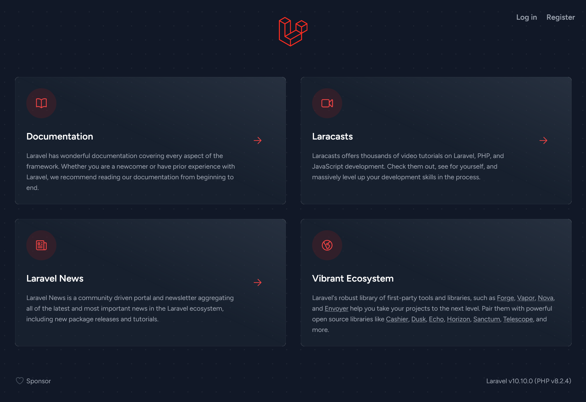
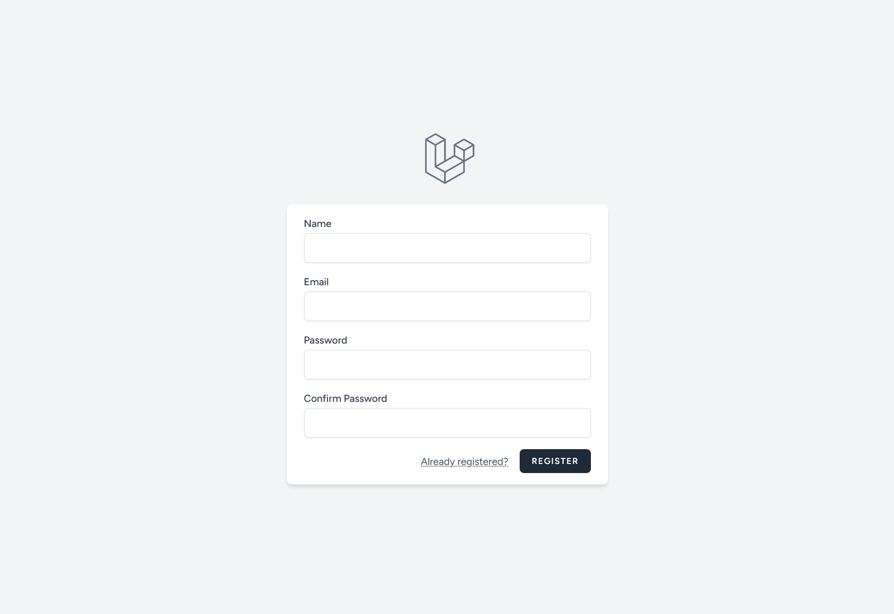
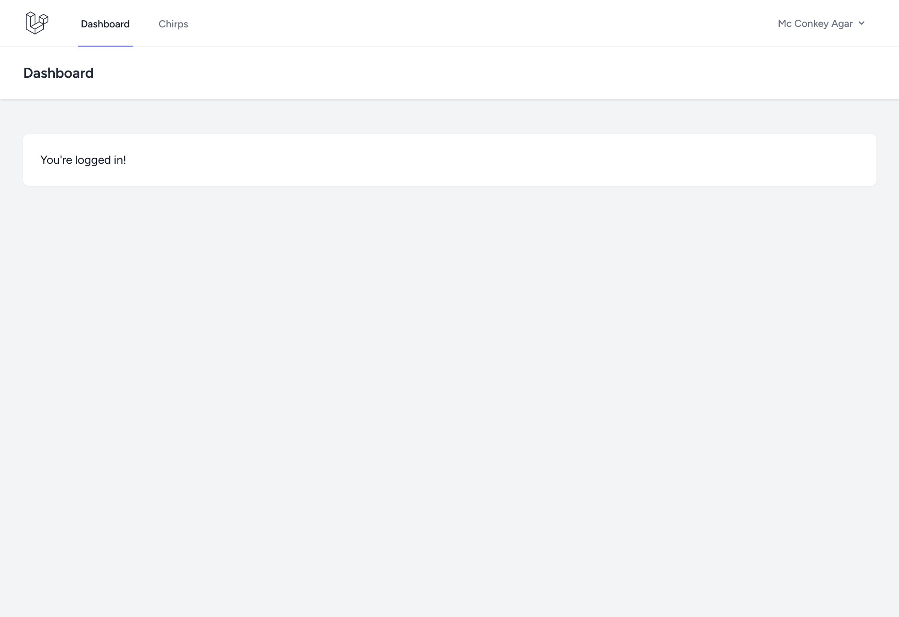
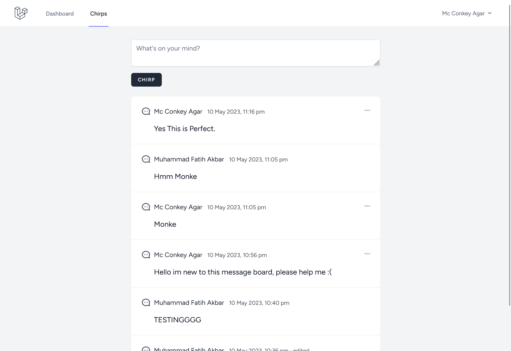
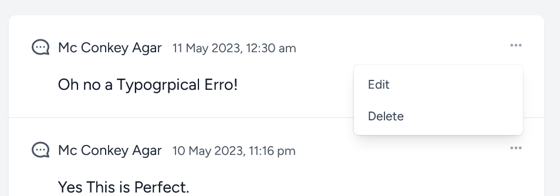
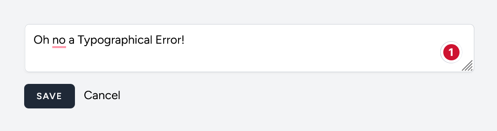
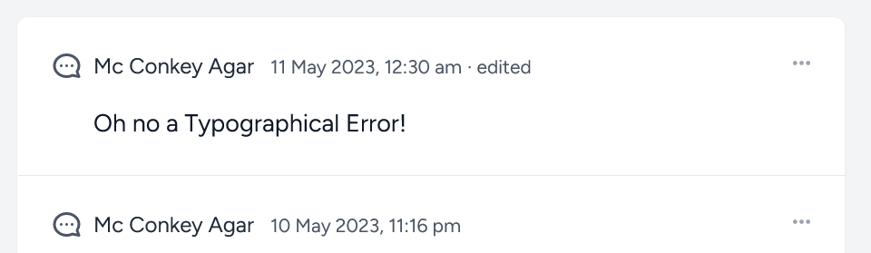

# Framework Programming Assignment - Week 9
Muhammad Fatih Akbar - 5025201117

## Running the Chirper

Before running the Laravel Chirper, you should have [XAMPP](https://www.apachefriends.org/) installed within your locals which will provides the necessary PHP and MySQL services to run the application and [Node.js](https://nodejs.org/en) for using [Vite](https://vitejs.dev/) for it to display the CSS correctly.

Once you have everthing, open up 2 terminals on the `chirper` directory. Run the following command on the first terminal:

```bash
npm run dev
```

Run the following command on the second terminal:

```bash
php artisan serve
```

Once both terminal are running, open up http://127.0.0.1:8000 which is the starting page.



## Registeration and Logging in

On the **top right** of the web page you should see the navigation links writter "Login" and "Register". To go to the Registration page, click on the mentioned "Register".



To register, input all of the fields in the registration form. Passwords must be atleast 8 characters long. Click the "Register" button once every field has been inputted. After which the web will automatically direct you to the Dashboard with your newly created account logged in.

Whenever logged out, to go to the Login page, click the "Login" in the starting page.


To Login, enter the username and password as what has been inputted in the registration form. Once logged in, the web will automatically redirect you to the Dashboard with your logged account.



## Making a Chirp

To start chirping, on the navbar of the Dashboard, click onto the "Chirps" link. This will redirect you to the Chirps Page.



To send a chirp, write any message in the textbox. Make sure messages are no longer than 255 characters or else the message wont be registered. Once you have finished typing the message, click on the Chirp button which will then send the message and make it visible in the message board.

## Editing & Deleting a Chirp



To Edit a chirp, click on the three dots on the top right corner of the message you want to edit which will open a dropdown, the click "Edit". This will direct you to the edit page.



To edit, change the message as in the textbox to your liking, then click save.



To delete a chirp, click on the three dots on the top right corner of the message you want to edit which will open a dropdown, the click "Delete". This will instantly delete the message you wanted to delete.

## References & External Links

+ [Laravel Bootcamp](https://bootcamp.laravel.com/)
+ [Laravel Quickstart](https://laravel.com/docs/10.x)
+ [XAMPP](https://www.apachefriends.org/)
+ [Composer](https://getcomposer.org/)
+ [Node.js](https://nodejs.org/en)
+ [Vite](https://vitejs.dev/)